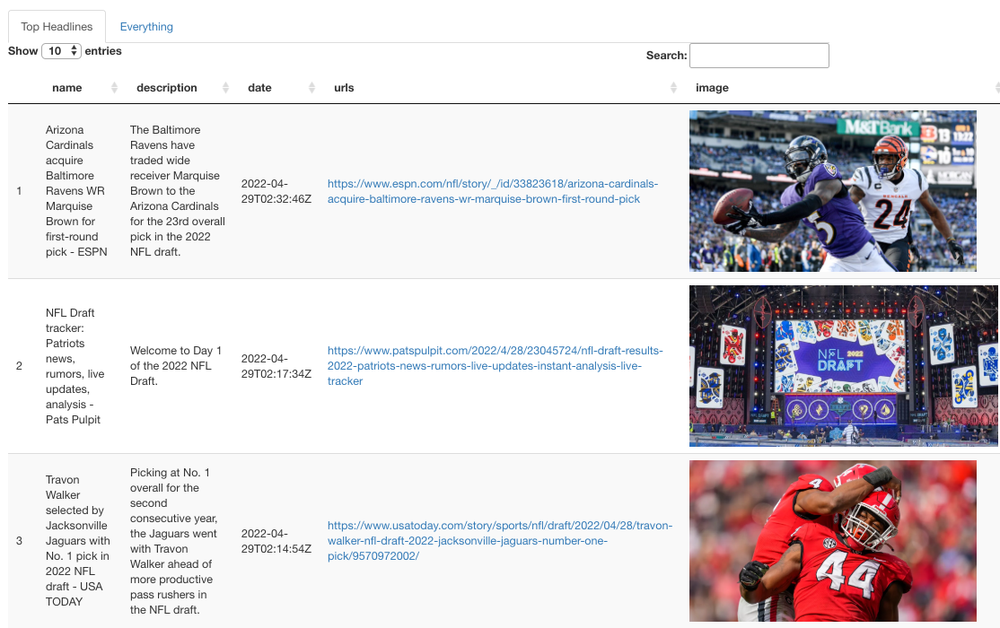

<!-- badges: start -->
[](https://codecov.io/gh/eshitazaman/stat585-project)
<!-- badges: end -->

“woRldnews” is a R package that allows users to search for top news in
50 countries and millions of articles from over 80,000 large and small
news sources and blogs in real time. Users can do relevant searches
using two distinct “shiny” apps. Users may search top headlines in fifty
countries with the first “shiny” app. Users can use the second app to
search for articles that they are interested in fifteen languages.

## Installation

woRldnews can be installed with devtools to get the most recent
production version from GitHub:

``` r
#install.packages('devtools') # if devtools is not already installed
#devtools::install_github('eshitazaman/stat585-project')
```

## Examples and Usage

Welcome to woRldnews! Before you can search for news and articles in R,
you’ll need to create a free account at \[Newsapi.org\]
(<https://newsapi.org>) and acquire an apikey by using news_api
function.

``` r
#library(woRldnews)
#newsapi_setup()
```

Newsapi will assign you an apikey. You can save this apikey to your
.Rprofile for future use by “newsapi_save_apikey” function.

``` r
#newsapi_apikey <- "paste_key_here"
#newsapi_save_apikey(apikey = newsapi_apikey)
```

## Using woRldnews

To do relevant searches, woRldnews features two “shiny” apps. To search
for news, you use runshiny function:

``` r
#runshiny("headlines")
```

When you run this function, you’ll receive the shiny widget below:


First you enter the apikey provided by newsapi.org. Then, from the
select boxes on the shiny.app, you select the country and category for
the news search. You receive the search results in a table format with
20 top headlines including title, description, date, url, and url to
image. By clicking the url you can access related websites.


To search for articles, you use runshiny function:

``` r
#runshiny("articles")
```

When you run this function, you’ll receive the shiny widget below:



First you enter the apikey provided by newsapi.org. Then,from the select
boxes on the shiny.app, you enter the keyword, select the language and
sort by for the articles search. You can narrow the search to specific
dates within the previous 30 days.  
\`\`

You receive the search results in a table format with 20 top headlines
including title, description, content, url, author and publication date.


## Vignettes

For more details, see the [vignette](./docs/articles/index.html).

## About Newsapi.org

The Newsapi.org is a basic, easy-to-use REST API that offers JSON search
results for current and historical news stories from over 80,000 sources
throughout the world.
