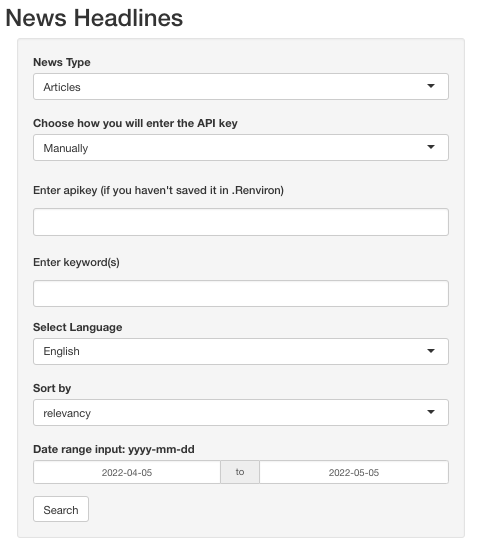
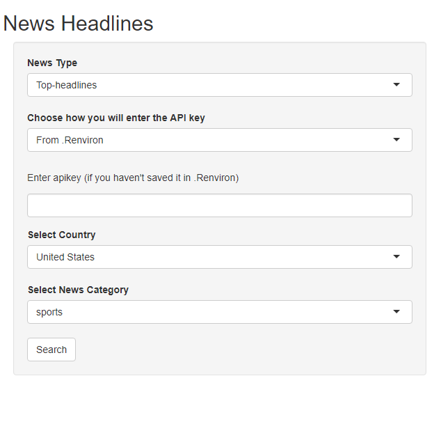
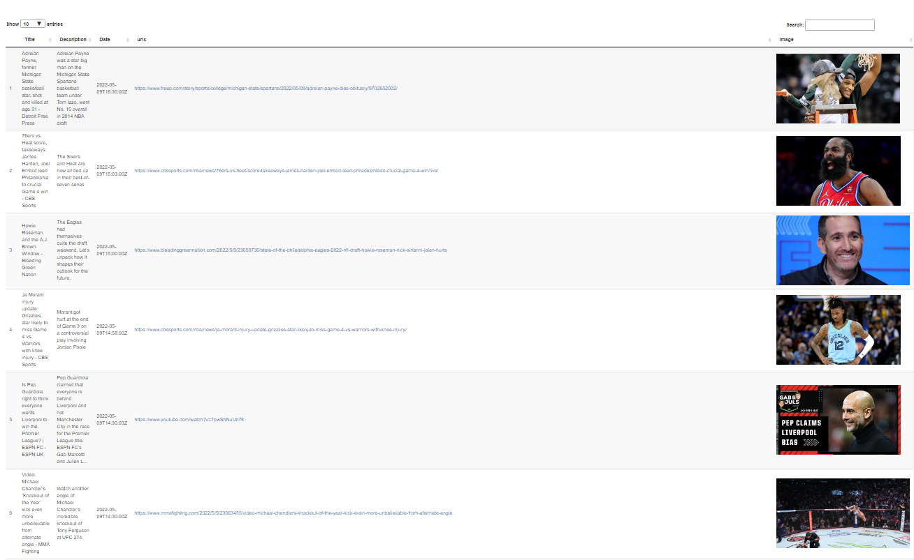
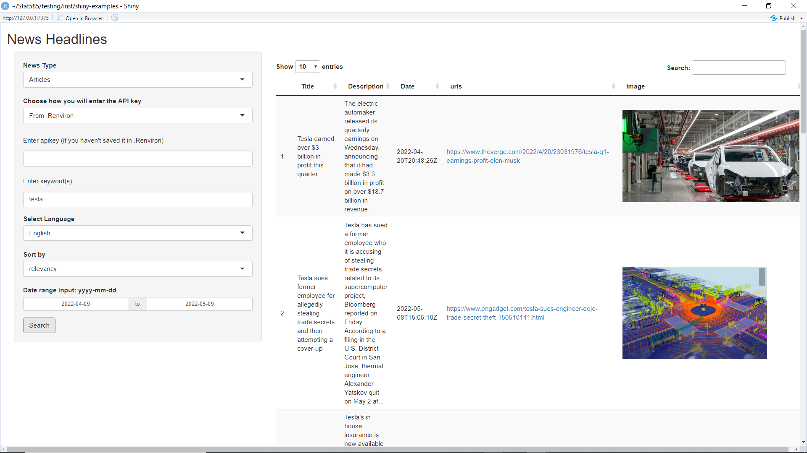

<!-- badges: start -->
[](https://codecov.io/gh/eshitazaman/stat585-project)
[](https://github.com/eshitazaman/stat585-project/actions)
<!-- badges: end -->

“woRldnews” is a R package that allows users to search for top news in
50 countries and millions of articles from over 80,000 large and small
news sources and blogs in real time. Users can do relevant searches
using two distinct “shiny” apps. Users may search top headlines in fifty
countries with the first “shiny” app. Users can use the second app to
search for articles that they are interested in fifteen languages.

## Installation

woRldnews can be installed with devtools to get the most recent
production version from GitHub:

``` r
#install.packages('devtools') # if devtools is not already installed
#devtools::install_github('eshitazaman/stat585-project')
```

## Examples and Usage

Welcome to woRldnews! Before you can search for news and articles in R,
you’ll need to create a free account at \[Newsapi.org\]
(<https://newsapi.org>) and acquire an apikey by using “get_apikey”
function.

``` r
#library(woRldnews)
#get_apikey()
```

Newsapi will assign you an apikey. You can save this apikey to .Renviron
file for future use. “save_apikey” function creates a project .Renviron
file and save your apikey in it.

``` r
#save_apikey(apikey)
```

## Using woRldnews

To do relevant searches, you use runshiny function:

``` r
#runshiny()
```

When you run this function, you’ll receive the shiny widget below:



If user selects, “Top-headlines”, they will see the interface as
following:



Choose between “articles” and “top headlines” in the first box to
determine the sort of search you wish to conduct. Then choose between
“Manually” and “From.Renviron” from the second box to enter the apikey.
If you want to search for articles, enter the term, choose the language,
and sort by. You can limit your search to certain dates in the last 30
days. You receive the search results in a table format with 20 articles
including title, description, content, url, author and publication date.
If you want to search for headlines, enter the country, and choose the
country. You receive the search results in a table format with 20 top
headlines including title, description, content, url, author and
publication date. By clicking the url you can access related websites.



Above it the sample search results of top-headlines on sports in the
USA.



Above is the sample search results of articles on the keyword “tesla” in
the time period of last 30 days.

## Vignettes

For more details, see the
[vignette](https://eshitazaman.github.io/stat585-project/articles/newsAPI.html).

## About Newsapi.org

The Newsapi.org is a basic, easy-to-use REST API that offers JSON search
results for current and historical news stories from over 80,000 sources
throughout the world.

<!-- badges: start -->
<!-- badges: end -->
